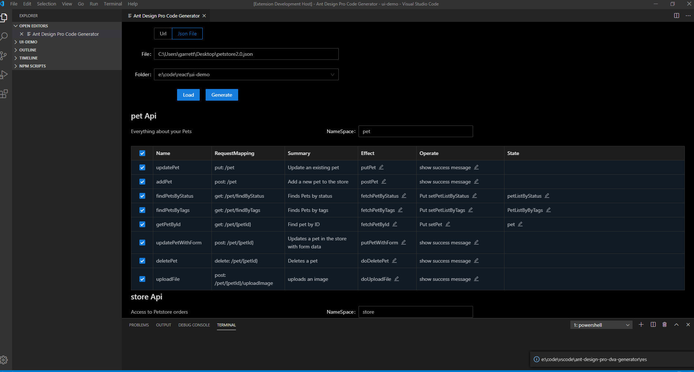
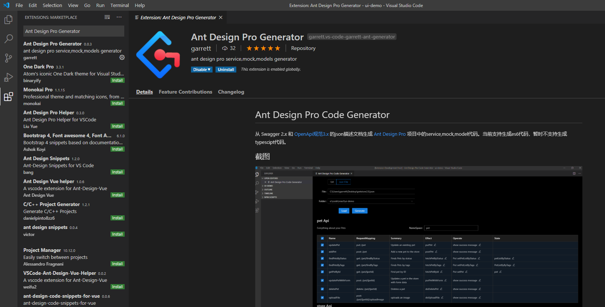

# Ant Design Pro Code Generator

从 Swagger 2.x 和 [OpenApi规范3.x](https://swagger.io/specification/) 的json描述文档生成 [Ant Design Pro](https://pro.ant.design/index-cn) 项目中的service,mock,model代码。当前支持生成es6代码，暂时不支持生成typescipt代码。

## 截图






## 项目结构

### antd-pro-generator

vscode插件项目

### antd-generator-core

核心代码库，api文档解析代码生成的主要代码

### antd-generator-ui

插件UI，使用ant design 4 组件库


## vscode插件运行

View--->Command Platte..., 查找 Ant Design Pro Code Generator 项运行

## 开发运行

1. git clone 

2. 在 ant-design-pro-dva-generator、antd-generator-core、antd-generator-ui目录分别执行 npm install

3. 先build一下antd-generator-core，如果antd-generator-core有修改，也要build一样其它两个项目才能引用到最新的代码。

4. 在antd-generator-ui目录下运行 npm start，ui运行端口默认3000，同时运行一个express 服务器，端口8081，web请求的链接通过代理到8081

## 调试web.js 和lib

   1. 在ui项目建调试配置，配置详情如下：

      ```json
      {
          "version": "0.2.0",
          "configurations": [
              {
                  "type": "node",
                  "request": "launch",
                  "name": "Launch Program",
                  "skipFiles": [
                      "<node_internals>/**"
                  ],
                  "program": "${workspaceFolder}\\web.js",
                  "outFiles": [
                      "${workspaceFolder}/**/*.js"
                  ]
              }
          ]
      }
      ```

      

   2. 在vscode启动调试,

   3. 在命令行执行 npm run ui

## 调试vscode插件

1. 调试配置

```json
{
    "version": "0.2.0",
    "configurations": [
        {
			"name": "Run Extension",
			"type": "extensionHost",
			"request": "launch",
			"runtimeExecutable": "${execPath}",
			"args": [
				"--extensionDevelopmentPath=${workspaceFolder}"
			]
		},
		{
			"name": "Extension Tests",
			"type": "extensionHost",
			"request": "launch",
			"runtimeExecutable": "${execPath}",
			"args": [
				"--extensionDevelopmentPath=${workspaceFolder}",
				"--extensionTestsPath=${workspaceFolder}/test/index"
			]
		}
    ]
}
```

2. 修改package.json中入口文件项改成 "main": "./src/extension"，发布修改回"main": "./dist/extension"。
3. 运行调试


## 使用说明

1. 选择从Url或者从本地文件加载接口文档，输入Url或者文件路径，然后load。显示文档信息，按tag分组，每个tag对应一个service/mock/model的js文件，文件名为tag名称。
2. 根据自己的情况修改model的namespace、各个api 对应的effect名称、effect对应的操作及state，完成之后generate
3. 生成完成，mock目录、src/services目录、src/models目录会生成相应的文件。文件重名时会以xxx.1.js,xxx.2.js等方式生成新的文件，不覆盖已有文件。如果重新生成注意合并文件或者修改文件名。一般情况下，生成的service不需要修改就可以直接使用。mock和model代码要适当修改。


 


